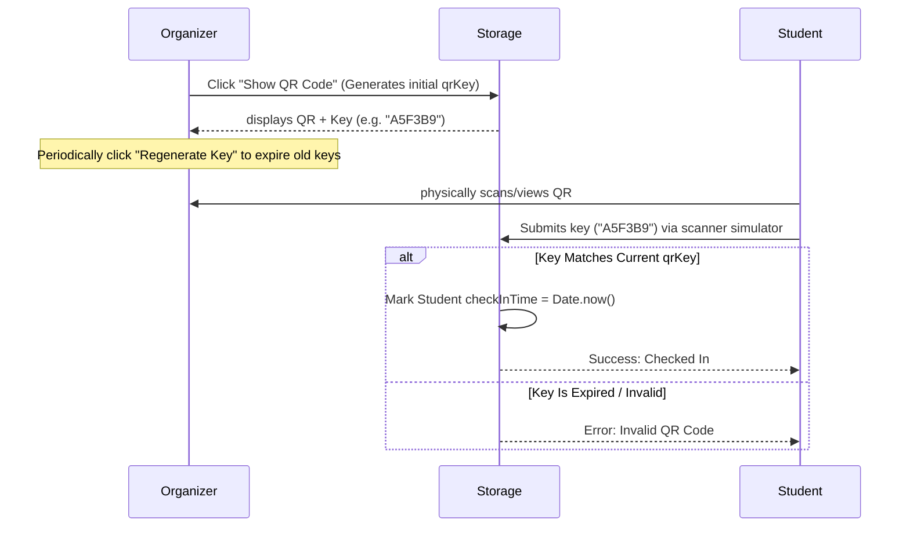

# HCMUT Event Organizing Web Application

A web application for organizing campus events at Ho Chi Minh City University of Technology (HCMUT). Built using React, Vite, and TypeScript, it allows students to register and check in/out of events, organizers to manage events and attendance, and admins to approve event requests.

---

> [!NOTE]
> **AI Agent Quick Reference Guide**: This repository is structured to be LLM/agent-friendly. Below is the layout, design guidelines, state system, and storage structures to help you get up to speed instantly.

---

## Technical Architecture & Sitemap

```
├── .agents/
│   └── AGENTS.md            # Project-specific rules and instructions
├── src/
│   ├── types.ts             # Global TypeScript interfaces (including separated profiles)
│   ├── main.tsx             # Application entry point
│   ├── index.css            # Custom CSS & HCMUT Design Tokens
│   ├── App.tsx              # View router and current active user state
│   ├── components/
│   │   ├── AuthPage.tsx     # Secure Login, Signup, and Reset Password Forms
│   │   ├── MailInboxSimulator.tsx  # Floating simulator widget displaying mock emails
│   │   ├── DevBackendConsole.tsx   # Developer console to execute grantRole() backend method
│   │   ├── Navbar.tsx       # HCMUT Brand Header & Profile Information
│   │   ├── EventCard.tsx    # Card listing event info & actions based on active role
│   │   ├── StudentDashboard.tsx   # Register for events, check contact info & scan keys
│   │   ├── OrganizerDashboard.tsx # Create events, track student contact details & show QRs
│   │   └── AdminDashboard.tsx     # Review pending approvals & global metrics
│   └── utils/
│       ├── storage.ts       # LocalStorage helpers (Hashing, Auth, grantRole, Email simulation)
│       └── mockData.ts      # Initial pre-seeded accounts & profiles (hashed passwords)
```

### Key Modules
1. [types.ts](file:///d:/Download/event-organize/src/types.ts): Separated data schemas for credentials (`AuthAccount`) and isolated profiles (`StudentProfile`, `OrganizerProfile`, `AdminProfile`).
2. [storage.ts](file:///d:/Download/event-organize/src/utils/storage.ts): Custom storage state provider. Contains an in-memory cache layer to optimize reads, logic for password hashing (SHA-256), CustomEvent reactive change dispatchers, and backend role assignment helper `grantRole()`.
3. [index.css](file:///d:/Download/event-organize/src/index.css): Implements the HCMUT brand theme with premium cubic-bezier transitions.

---

## State Flow & QR Security System

The check-in/out mechanism requires proof of physical presence at the event. It runs on a dynamic keys protocol:



### Event Lifecycle Status
- `pending`: Newly created events by organizers. Hidden from students; visible to admins.
- `approved`: Validated by admin. Visible to students for registration.
- `rejected`: Declined by admin. Invisible to students; archived in history.

---

## Local Storage Schemas & Privacy Rules

Data is serialized to JSON and persisted under these keys. Access to specific fields is strictly controlled in code according to user permissions:

### `hcmut_auth` (Credentials Database)
Stores account credentials. Passwords are saved as SHA-256 hex hashes.
```typescript
interface AuthAccount {
  id: string;
  email: string;
  passwordHash: string;
  role: 'student' | 'organizer' | 'admin';
  resetToken?: string; // One-time token deleted immediately after use
}
```

### `hcmut_student_profiles` (Student Database)
Visible only to organizers and the registered students themselves.
```typescript
interface StudentProfile {
  id: string;
  name: string;
  phone: string;
  email: string;
}
```

### `hcmut_organizer_profiles` (Organizer Database)
Visible only to registered students of their events.
```typescript
interface OrganizerProfile {
  id: string;
  name: string;
  phone: string;
  email: string;
}
```

### `hcmut_admin_profiles` (Admin Database)
Admins have no contact info stored in their profiles.
```typescript
interface AdminProfile {
  id: string;
  name: string;
}
```

### `hcmut_events`
```typescript
interface Event {
  id: string;
  title: string;
  description: string;
  date: string; // ISO date-time string
  location: string;
  organizerId: string;
  status: 'pending' | 'approved' | 'rejected';
  maxParticipants: number;
  bannerUrl?: string;
  qrKey?: string;         // Current valid check-in token (6-char alphanumeric)
  qrGeneratedAt?: number;  // Timestamp of token generation
}
```

### `hcmut_registrations`
```typescript
interface Registration {
  id: string;
  studentId: string;
  eventId: string;
  registeredAt: number;   // Epoch timestamp
  checkInTime?: number;    // Epoch timestamp (if checked in)
  checkOutTime?: number;   // Epoch timestamp (if checked out)
}
```

### `hcmut_inbox`
Simulates email delivery. Contains messages dispatched for password reset operations.
```typescript
interface SimulatedEmail {
  id: string;
  to: string;
  subject: string;
  body: string;
  timestamp: number;
}
```

---

## Design System (HCMUT theme)

The design is customized using CSS custom properties defined in [index.css](file:///d:/Download/event-organize/src/index.css):
- **Primary Brand Color**: `--hcmut-blue-light: #1488D8;` (used for standard buttons, highlights)
- **Secondary Brand Color**: `--hcmut-blue-dark: #030391;` (used for navbar branding, titles, card headers)
- **Accent Highlight**: `--hcmut-accent: #fca903;` (used for gold accents, alerts, notices)
- **Font-Family**: `'Inter', sans-serif` loaded from Google Fonts.

---

## Performance & Security Hardening

To make the application production-ready and optimized, the following architectural enhancements have been implemented:
1. **Event-Driven Reactivity**: Replaced the 1-second interval local storage polling with a CustomEvent (`'hcmut_storage_change'`) emitter. Views, dashboards, and the email simulator now react immediately to database changes without blocking the main thread or causing rendering delays.
2. **In-Memory Cache Layer**: Implemented an in-memory storage buffer in [storage.ts](file:///d:/Download/event-organize/src/utils/storage.ts) to eliminate sequential and nested LocalStorage JSON parses, making profile fetches O(1) in memory.
3. **Cryptographically Secure Values**: Upgraded password reset tokens and QR key generation from insecure `Math.random()` to use cryptographically secure values using the browser's Web Crypto API (`crypto.getRandomValues`).
4. **Data Isolation & Profile Retention**: Fixed details copying inside `grantRole()` to successfully preserve user attributes when granting elevated permissions.

---

## Developer Operations

### Installing Dependencies
```bash
npm install
```

### Development Server
```bash
npm run dev
```

### Building / Type-checking
```bash
npm run build
```
This runs `tsc -b` and compiling client production assets. Always verify typecheck passes before pushing changes.
